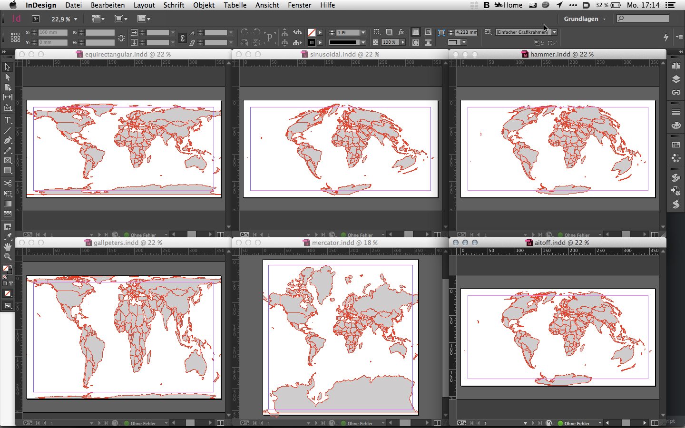

IDMap
=====
  
Creating Maps with InDesign  
This is early draft. not ready for usage. If you still want to give it a try...

##Usage  

If you don't want to develop just grab the latest version from the /dist folder, place it in your scripts folder and run it. See the head of the file for some options. As set in src/idmap/globals.jsx. 


###Currently you can:

Edit the settings Object at the beginning of the script.

```js
    var DEBUG = true; // just for debugging to the console
    var settings = {
      new_document: true,
      new_layer: true,
      new_layer_name: 'map',
      /*
      select the projection type you want
      equirectangular = 0
      mercator = 1
      gallpeters = 2
      hammer = 3
      sinusoidal = 4
      aitoff = 5
       */
      projection_type: 5,
    };
    // check out http://dbsgeo.com/latlon/
    // to get lat lon coordinates
    // this is the world bounding box
    settings.boundingBox = {
      zoomed: false,
      ul_lat: 90,
      ul_lon: -180,
      lr_lat: -90,
      lr_lon: 180
    };
```


-------

Define if you want to use the current doc or a new one.

    new_document: true

Define if you wan't to draw onto a new layer. If you set this to false make sure you have a layer selected.  

    new_layer: true

Define the name of that new layer.

    new_layer_name: 'map'

 change the projection type.  


    /*
    select the projection type you want
    equirectangular = 0
    mercator = 1
    gallpeters = 2
    hammer = 3
    sinusoidal = 4
    aitoff = 5
     */
    projection_type: 5,


If you change the `settings.boudingBox` and set `zoomed` to `true` you should be able to zoom into the data. This is only tested in equirectangular projection right now.

    // check out http://dbsgeo.com/latlon/
    // to get lat lon coordinates
    // this is the world bounding box
    settings.boundingBox = {
      zoomed: false,
      ul_lat: 90,
      ul_lon: -180,
      lr_lat: -90,
      lr_lon: 180
    };
    
    //  set a different bbox
    // this is berlin potsdam bounding box
    //
    // settings.boundingBox = {
    //    zoomed: true,
    //   ul_lon: 12.9638671875, // the most left point
    //   ul_lat: 52.70468296296834, // the most top point
    //   lr_lat: 52.338695481504814, // the most bottom point
    //   lr_lon: 13.8153076171875, // the most right point
    // };
    //

##Development

###Setup Mac OSX & InDesign CC  

Open Terminal  

Install osx command line tools. (If not already installed)

    xcode-select --install  

Install homebrew [homebrew](http://brew.sh/) (If not already installed)

    ruby -e "$(curl -fsSL https://raw.github.com/Homebrew/homebrew/go/install)"  

Install [node.js](http://nodejs.org) via [homebrew](http://brew.sh)  

    brew install node  

Install the [Grunt](http://gruntjs.com) command line interface with [npm](https://www.npmjs.org) globally  

    npm install -g grunt-cli  

Clone the repo with git (you use [git](http://git-scm.com) right?) and `cd` into it  

    cd /Applications/Adobe\ InDesign\ CC/Scripts/Scripts\ Panel/
    git clone git@github.com:fabiantheblind/IDMap.git && cd IDMap  

Initialize all submodules and then update  

    git submodule init && git submodule update  

Now install all node modules  

    npm install  

If you want to build run

    grunt build-dist  

If you want to code on it use the default grunt function. It watches for changes and builds always a new version. So just run:

    grunt

Grunt compiles a lot of files into one final file. There are some libraries:

- [extendscript.geo](https://github.com/fabiantheblind/extendscript.geo)  
- [extendscript.csv](https://github.com/fabiantheblind/extendscript.csv) (Not used right now)  
- [extendscript.prototypes](https://github.com/fabiantheblind/extendscript.prototypes)  
- [world.geo.json](https://github.com/johan/world.geo.json)  

If you want to change them you need to fork and exchange the submodules.


The main files that you can edit right away are:  

- [src/idmap/main.jsx](src/idmap/main.jsx) The main function where everything is called. This is your entry point.  
- [src/idmap/document.jsx](src/idmap/document.jsx) Setting up the document
- [src/idmap/geo.jsx](src/idmap/geo.jsx) generate polygon path data from geo data using the [extendscript.geo library](https://github.com/fabiantheblind/extendscript.geo) I'm working on.   
- [src/idmap/globals.jsx](src/idmap/globals.jsx) Global settings. Can be set by the user. Things like projection type and zoom.   
- [src/idmap/license.jsx](src/idmap/license.jsx) Just the license MIT  
- [src/idmap/polygon.jsx](src/idmap/polygon.jsx) Takes Array of path points [[x,y],[x,y],[x,y],[x,y]...] and returns a polygon object for styling.  
- [src/idmap/styling.jsx](src/idmap/styling.jsx) Some functions for creating object styles and applying them to polygons.  


###Setup Win  

install [node.js](http://nodejs.org)   

install [Grunt](http://gruntjs.com)  

clone repo  

clone submodules  

run grunt build-dist  

or  

run grunt  

sorry for now this is all I can say. Will try to test it on a windows computer.  


-----------

##License  

Copyright (c)  2014 Fabian "fabiantheblind" Morón Zirfas  
Permission is hereby granted, free of charge, to any person obtaining a copy of this software and associated documentation files (the "Software"), to deal in the Software  without restriction, including without limitation the rights to use, copy, modify, merge, publish, distribute, sublicense, and/or sell copies of the Software, and to  permit persons to whom the Software is furnished to do so, subject to the following conditions:  
The above copyright notice and this permission notice shall be included in all copies or substantial portions of the Software.  
THE SOFTWARE IS PROVIDED "AS IS", WITHOUT WARRANTY OF ANY KIND, EXPRESS OR IMPLIED, INCLUDING BUT NOT LIMITED TO THE WARRANTIES OF MERCHANTABILITY, FITNESS FOR A  PARTICULAR PURPOSE AND NONINFRINGEMENT. IN NO EVENT SHALL THE AUTHORS OR COPYRIGHT HOLDERS BE LIABLE FOR ANY CLAIM, DAMAGES OR OTHER LIABILITY, WHETHER IN AN ACTION OF  CONTRACT, TORT OR OTHERWISE, ARISING FROM, OUT OF OR IN CONNECTION WITH THE SOFTWARE OR THE USE OR OTHER DEALINGS IN THE SOFTWARE.  

see also [http://www.opensource.org/licenses/mit-license.php](http://www.opensource.org/licenses/mit-license.php)

